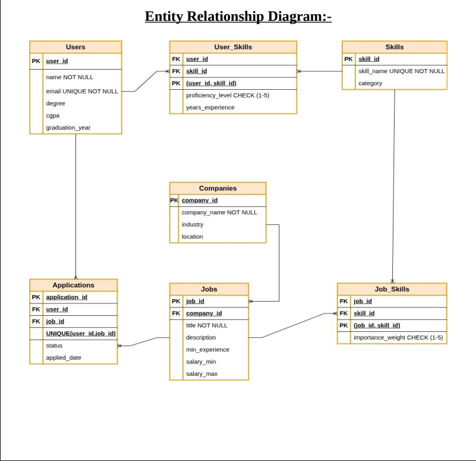

# 🎯 AI Skill & Job Recommendation System

A full-stack web application that uses Machine Learning to match students with suitable job opportunities based on their skills, and allows companies to post jobs and manage applications.

---

## Table of Contents

- [Project Overview](#project-overview)
- [Features](#features)
- [Tech Stack](#tech-stack)
- [System Architecture](#system-architecture)
- [Database Schema](#database-schema)
- [Installation & Setup](#installation--setup)
- [ML Recommendation Strategies](#ml-recommendation-strategies)
- [User Roles](#user-roles)
- [Project Structure](#project-structure)
- [Screenshots](#screenshots)
- [Future Enhancements](#future-enhancements)
- [Contributors](#contributors)
- [License](#license)

---

## Project Overview

The **AI Skill & Job Recommendation System** is a database-driven platform that bridges the gap between students seeking jobs and companies looking for talent. The system analyzes user skills against job requirements using multiple ML strategies to provide personalized job recommendations.

### Key Highlights:
- **AI-Powered Recommendations** using scikit-learn
- **Multiple Recommendation Strategies** (Skill-Based, Balanced, Social, Trending)
- **Student Dashboard** with skill management and application tracking
- **Company Portal** for job posting and applicant management
- **Secure Authentication** with password management
- **Responsive Design** with collapsible sidebar

---

## Features

### For Students
| Feature                   | Description                                                       |
|---------------------------|-------------------------------------------------------------------|
| **Authentication**        | Secure login and signup with password validation                  |
| **Profile Management**    | Edit personal info, add/update/remove skills                      |
| **AI Recommendations**    | Get job matches using ML algorithms                               |
| **Application Tracking**  | Apply to jobs and track status (Pending/Accepted/Rejected)        |
| **Cancel Applications**   | Withdraw pending applications anytime                             |
| **Password Management**   | Change password with real-time validation                         |
| **Dashboard**             | View skills, applications count, and profile summary              |

### For Companies
| Feature                  | Description                                |
|--------------------------|--------------------------------------------|
| **Company Profile**      | Manage company details and information     |
| **Job Posting**          | Create, edit, and delete job listings      |
| **Skill Requirements**   | Add skills with importance weights (1-5)   |
| **Applicant Management** | View applicants with match scores          |
| **Application Review**   | Accept or reject applications              |
| **Analytics Dashboard**  | View jobs posted and applications received |

---

## Tech Stack

| Category       | Technology                                    |
|----------------|-----------------------------------------------|
| **Backend**    | Python 3.10+, Flask                           |
| **Database**   | MySQL                                         |
| **ML/AI**      | scikit-learn, pandas, numpy                   |
| **Frontend**   | HTML5, CSS3, Bootstrap 5                      |
| **Icons**      | Font Awesome 6                                |
| **Fonts**      | Google Fonts (Poppins)                        |
| **Additional** | mysql-connector-python, SQLAlchemy (optional) |

---

## 🏗️ System Architecture

┌─────────────────────────────────────────────────────────────┐
│ Frontend (Browser)                                          │
│ ┌─────────────┐ ┌─────────────┐ ┌─────────────────────┐     │
│ │ Student     │ │ Company     │ │ Career Services     │     │
│ │ Dashboard   │ │ Dashboard   │ │ (Analytics)         │     │
│ └─────────────┘ └─────────────┘ └─────────────────────┘     │
└─────────────────────────────────────────────────────────────┘
│
▼
┌─────────────────────────────────────────────────────────────┐
│ Flask Application                                           │
│ ┌─────────────┐ ┌─────────────┐ ┌─────────────────────┐     │
│ │ Routes      │ │ Session     │ │ Template Engine     │     │
│ │ (app.py)    │ │ Management  │ │ (Jinja2)            │     │
│ └─────────────┘ └─────────────┘ └─────────────────────┘     │
└─────────────────────────────────────────────────────────────┘
│
▼
┌─────────────────────────────────────────────────────────────┐
│ ML Module (ml/)                                             │
│ ┌─────────────┐ ┌─────────────┐ ┌─────────────────────┐     │
│ │ Skill       │ │Collaborative│ │ Hybrid              │     │
│ │ Matcher     │ │ Filter      │ │ Recommender         │     │
│ └─────────────┘ └─────────────┘ └─────────────────────┘     │
└─────────────────────────────────────────────────────────────┘
│
▼
┌─────────────────────────────────────────────────────────────┐
│ MySQL Database                                              │
│ ┌───────┐ ┌───────┐ ┌───────┐ ┌──────────┐ ┌─────────────┐  │
│ │ Users │ │ Skills│ │ Jobs  │ │Companies │ │Applications │  │
│ └───────┘ └───────┘ └───────┘ └──────────┘ └─────────────┘  │
│ ┌─────────────┐ ┌─────────────┐                             │
│ │ User_Skills │ │ Job_Skills  │                             │
│ └─────────────┘ └─────────────┘                             │
└─────────────────────────────────────────────────────────────┘

---

## Database Schema

### Tables Structure

| Table            | Description                                                      |
|------------------|------------------------------------------------------------------|
| **Users**        | Student information (name, email, degree, CGPA, graduation year) |
| **Companies**    | Employer information (company name, industry, location, email)   |
| **Skills**       | Skill repository (skill name, category)                          |
| **User_Skills**  | Student-skill mapping with proficiency (1-5) and experience      |
| **Jobs**         | Job postings (title, description, experience, salary)            |
| **Job_Skills**   | Job-skill mapping with importance weight (1-5)                   |
| **Applications** | Student applications with status tracking                        |

### ER Diagram



---


## Installation & Setup

### Prerequisites
- Python 3.10 or higher
- MySQL Server
- pip (Python package manager)

### Step 1: Clone the Repository
```bash
git clone https://github.com/Talha-Zaheer-04/AIJobRecommenderSystem.git
cd AIJobRecommenderSystem
```

### Step 2: Create Virtual Environment
```bash
python -m venv name_of_environment
source venv/bin/activate  # On Windows: venv\Scripts\activate
```

### Step 3: Install Dependencies
```bash
pip install -r requirements.txt
```

### Step 4: Configure Database

1. Create MySQL database:
``` sql
CREATE DATABASE sem_proj;
USE sem_proj;
```

2. Run the schema creation script:
``` bash
mysql -u root -p sem_proj < database/schema.sql
```

3. Update database credendtials in db_config.py:
``` python
DB_CONFIG = {
    'host': 'localhost',
    'user': 'root',
    'password': 'your_password',
    'database': 'sem_proj'
}
```

---


### Step 5: Run the Application
``` bash
python app.py
```

---

### Step 6: Access the Application

Open your browser and navigate to: http://localhost:5000

---

### Default Test Accounts

| Role	    | Email	                    | Password |
|-----------|---------------------------|----------|
| Student	| abdul.azeez@nu.edu.pk	    | temp123  |
| Student	| talha.zaheer@nu.edu.pk	| temp123  |
| Student	| mubeen.haider@nu.edu.pk	| temp123  |
| Company	| techcorp@techcorp.com	    | temp123  |
| Company	| dataworks@dataworks.com	| temp123  |
| Company	| innovate@innovate.com	    | temp123  |

---

###  ML Recommendation Strategies

The system uses a hybrid recommendation engine with four configurable strategies:

Strategy	Weight Distribution	                                Best For
Skill Based	100% Skills	                                        Users who know exactly what they want
Balanced	50% Skills + 30% Collaborative + 20% Popularity	    General recommendations
Social	    30% Skills + 60% Collaborative + 10% Popularity	    Discovering similar opportunities
Trending	20% Skills + 20% Collaborative + 60% Popularity	    Seeing popular jobs

---

### How Match Score is Calculated
``` text
Match Score = Σ(user_proficiency × job_importance) / Σ(5 × job_importance) × 100
```

Example:

Job requires: Python(5), SQL(3)
User has: Python(5), SQL(4)
Perfect score = (5×5) + (5×3) = 40
User score = (5×5) + (4×3) = 37
Match = 92.5%

---

### User Roles

#### Student
View and manage personal profile
Add/update/remove skills
Get AI-powered job recommendations
Apply to jobs
Track application status
Cancel pending applications

#### Company
Manage company profile
Post new jobs with skill requirements
Edit/delete existing jobs
View applicants with match scores
Accept/reject applications
View recruitment analytics

### Project Structure
``` text
job_recommendation_system/
│
├── app.py                          # Main Flask application
├── db_config.py                    # Database configuration
├── recommendation_engine.py        # Original recommendation engine
├── ml_integration.py               # Bridge between Flask and ML
│
├── ml/                             # ML Module
│   ├── __init__.py
│   ├── config.py                   # ML configuration
│   ├── data_preprocessor.py        # Data extraction
│   ├── skill_matcher.py            # Skill-based matching
│   ├── collaborative_filter.py     # Collaborative filtering
│   └── hybrid_recommender.py       # Hybrid recommender
│
├── templates/                      # HTML Templates
│   ├── base.html                   # Landing page layout
│   ├── layout.html                 # Dashboard layout (collapsible sidebar)
│   ├── index.html                  # Landing page
│   ├── login.html                  # Login page
│   ├── signup.html                 # Signup selection page
│   ├── signup_student.html         # Student registration
│   ├── signup_company.html         # Company registration
│   ├── dashboard.html              # Student dashboard
│   ├── manage_skills.html          # Skill management
│   ├── recommendations.html        # Job recommendations
│   ├── applications.html           # My applications
│   ├── apply.html                  # Job application
│   ├── edit_student_profile.html   # Edit student profile
│   ├── change_password.html        # Change password
│   ├── company_profile.html        # Company profile
│   ├── edit_company_profile.html   # Edit company profile
│   ├── company_jobs.html           # Company job listings
│   ├── post_job.html               # Post new job
│   ├── edit_job.html               # Edit job
│   └── applicants.html             # View applicants
│
├── static/                         # Static files
│   └── style.css                   # Custom CSS
```

---

### Future Enhancements
Email Notifications - Alert students when application status changes
Resume Upload - Allow students to upload resumes
Job Alerts - Notify students about new matching jobs
Company Reviews - Allow students to rate companies
Advanced Analytics - More detailed recruitment insights
API Integration - LinkedIn profile import
Mobile App - React Native / Flutter mobile version

### Contributors
Muhammad Talha Zaheer
Muhammad Mubeen Haider

### License
This project is for educational purposes as part of the Database Management System course.

### Acknowledgments
Course Instructor - For guidance and support
scikit-learn - For ML algorithms
Bootstrap - For frontend components
Font Awesome - For icons

---

### Contact
For any queries or suggestions, please reach out to:
Email: mtalhazaheer2004@gmail.com
GitHub: Talha-Zaheer-04